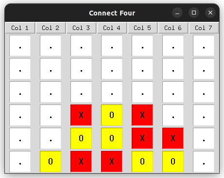

# Connect Four

<br>
*Screenshot of the Connect Four game with the GUI interface.*

A Python implementation of the classic Connect Four game. This version is designed to be run as a command-line application, allowing for two players (human or computer) to compete in a fun and strategic match.

## Features
- Play Connect Four in the terminal.
- Supports two players: human vs human, human vs computer, or computer vs computer.
- Simple interface with clear instructions for use.
- New GUI interface for a more interactive experience.


## Prerequisites
Ensure you have Python 3.6 or later installed on your system. You can check your Python version by running:
```bash
python --version
```
The game only uses standard libraries, so there are no additional dependencies to install.

## Installation

First, clone the repository to your local machine:
```bash
git clone https://github.com/johnkou97/ConnectFour.git
```

You can run the game either by installing it as a Python package or directly executing the script. Follow the instructions below based on your preferred method.


### Option 1: Run Without Installation
You can directly execute the script without installing it.

1. Go to inside the `ConnectFour` directory where `setup.py` is located:
   ```bash
   cd ConnectFour
   ```

2. Run the game using the Python interpreter:
   ```bash
   python -m connect_four.main
   ```
   The -m flag allows you to run a module as a script.

### Option 2: Install Locally
Install the package locally to make the game accessible from anywhere on your system.

1. Navigate to the project directory where `setup.py` is located:
   ```bash
   cd ConnectFour
   ```

2. Install the package using pip:
   ```bash
   pip install -e .
   ```
   The -e flag installs the package in editable mode, allowing you to make changes to the source code.

3. Run the game using the command-line entry point:
   ```bash
   connect-four
   ```

## GUI Interface

The game now includes a graphical user interface (GUI) for a more interactive experience. The GUI was built using the Tkinter library, which is included with Python by default.

To play the game with the GUI interface, there are again two options:
- Run the game without installation:
  ```bash
  python -m connect_four.main --gui
  ```
- Install the package locally as before and run the game:
  ```bash
  connect-four-gui
  ```
The GUI interface provides the same functionality as the command-line version, allowing you to play against another player or a computer opponent.

## How to Play

The game is played on a 6x7 grid. Players take turns dropping their discs into one of the seven columns. The goal is to connect four of your discs in a row (horizontally, vertically, or diagonally) before your opponent.

1. At the start of the game, you will be prompted to specify whether each player is a Human or a Computer.
2. During a Human player's turn, you will input the column number (1-7) where you want to drop your disc.
3. The game continues until one player connects four discs or the board is full, resulting in a draw.

**For the GUI version:**
- Click on the column where you want to drop your disc.
- The game will automatically switch between players and display the winner or a draw at the end.
- After the game ends, there is an option to play again or exit the game.

## Project Structure
```
ConnectFour/
├── connect_four/
│   ├── __init__.py
│   ├── board.py          # Contains the Board class
│   ├── cli.py            # Contains the CLI game interface and logic
│   ├── gui.py            # Contains the GUI game interface and logic
│   ├── player.py         # Contains the Player class
│   └── main.py           # Entry point for the game
├── setup.py              # For package installation
└── README.md             # This file
```

## Notes
- The game was built for educational purposes.
- Currently designed for local execution and not published to any external repositories or package managers.

## Future Improvements
- ✅ Add GUI functionality. ✅
- Implement Unit Tests for the game logic.
- Improve AI for computer players with more strategic decision-making.